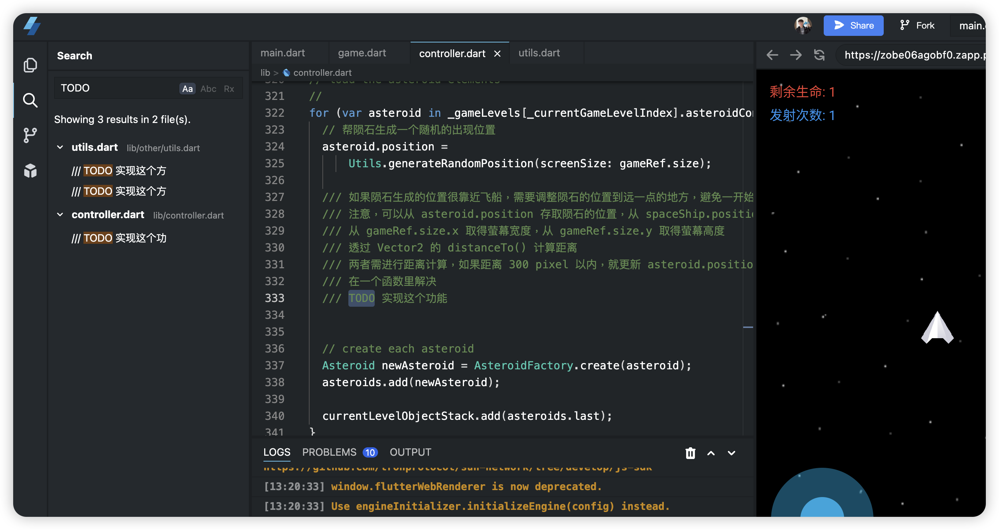
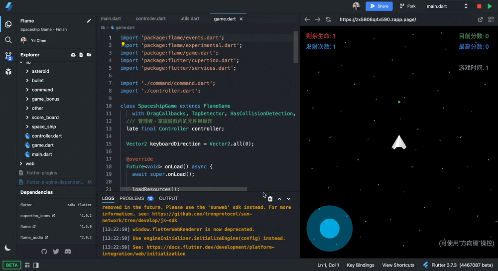

# 亲子AI编程星际之旅

This project is the topic for DevFest Shanghai 2023. Talk about the game component and let the attendees implement some features. Enjoy the game development.

I put the project in Zapp online IDE. It helps us to share the project to everyone. Start in the seconds without environment setup.

[Details](https://github.com/chyiiiiiiiiiiii/presentations-and-slides/tree/main/Google%20DevFest%20Shanghai%202023%20part2)

## Environment
- flame v1.5.0

## Features
- [x] 👆🏻 Use `TapDetector` to tap for shooting the bullet
- [x] 🕹️ Use `JoystickComponent` to control the spaceship
- [x] ⌨️ Use `KeyboardEvents` to control the spaceship
- [x] ⏱️ Use `TimerComponent` to calculate the time goes.
- [x] 💥 Use `CollisionCallbacks` and `HitBox` for components touching
- [x] 📷 Use `Camera` for shaking effect with explosion
- [x] 🎇 Use `ParticleSystemComponent` for destroy effect
- [x] 🔊 Use `FlameAudio` to play sound for shooting and explosion
- [x] Use `ParallaxComponent` effect to feel the moving
- [x] Add ScoreBoard for displaying information

## Start

First, Sign in Github account, and fork the project. Then you can start your own version of the game.

[🕹️ Zapp - 70% - Implement](https://zapp.run/edit/flame-zobe06agobf0?entry=lib/main.dart&file=lib/game.dart)

> Search "TODO" keyword to find out the code that need to implemented.
> 

[🎮 Zapp - 100% - Full Version](https://zapp.run/edit/flame-zx5806q4x590?entry=lib%2Fmain.dartt)

## Demo

---

Shout out to Piotr Paweska. Thanks for the great course to help developers learn Flame.